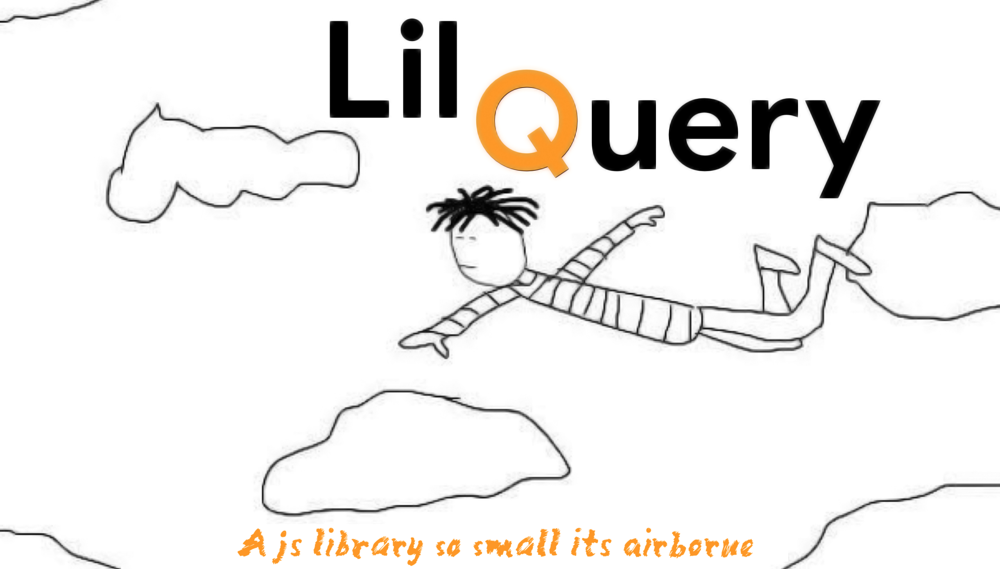

# Lil-query (BETA)
Write Less, Do a lil bit more. \

###### Image by [Vishnu Kumar](https://www.instagram.com/vshnukmr/)

Lil Query is a minimalist js library for getting $#*! for the DOM. By shorting Javascript syntax, without compromising in readability, it's a very convenient tool to add into your development cycle, and you will hate to go back.

# Getting Started
Download the js files here \
or use the raw git \
\
JS fiddle boilerplate

# Getting an element (from the DOM)
Getting element from the DOM shouldn't be as long or as hard as it is right now. Instead you can use the get function and pass in a string with the proper id class speficier.
`get('#id')` \
When getting element by class it is required to pass in a function in string format as the second peremater, unless the class contains only one element. You can reffer the elements under the class name by using 'el'. \
`let theFunction = () =>{el.style.color = 'blue'};` \
`get('.class','theFunction')`

# Getting an element by Id
id - type locked id selector/
`id('elementID).style.color = 'blue'` \
To be consistent you may enter a function (in string format) as the second peremater just like before. /
`let theFunction = () =>{el.style.color = 'blue'};` \
`id('elementID','theFunction')`

# Getting element by class
classGetAll -  type locked class selector \
`let theFunction = () =>{el.style.color = 'blue'};` \
`classGetAll('theClass','theFunction')` \
\
classGet - gets a certian element from class \
`classGet('theClass',2).style.color = blue;` \
\
classLength - returns the length of a certian class \
`classLength('theClass')` \
# Getting element by tag name
tag - type locked class tag selector
`tag('tagname', 0)`
# Accessing the document object
doc - docment object reference shortcut
`doc.property`

# Logging to console
log - console.log shortcut
`log('hello world')`

# Contributing
Yes please! Make sure to update the docs, and the TODO list and a minified version of the library.